# Ali Hassan

**Product-Minded AI & Full-Stack Software Engineer**

Every artifact in the Engineering Operating System exists to demonstrate deliberate engineering—where systems thinking, technical depth, craftsmanship, clarity, and long-term quality consistently take precedence over trends, spectacle, or self-promotion.

  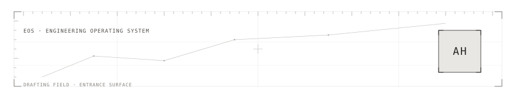
  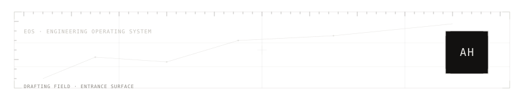

  
  

Pakistan · BS in Computer Science, FAST NUCES

  
  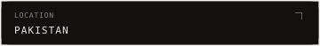

Building independently and open to full-time software engineering opportunities.

  
  

  
  

## Philosophy

  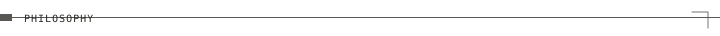
  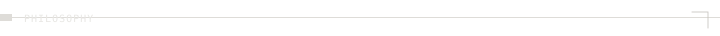

Good engineering is when the code disappears behind the problem it solves. If someone else can understand it, extend it, and trust it months later without needing the author in the room, the job is done well.

1. Solve the real problem before writing code.
2. Build complete systems, not isolated features.
3. Let evidence guide decisions.

  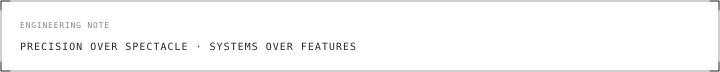
  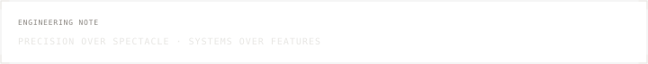

  
  

## Engineering focus

  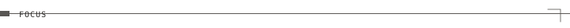
  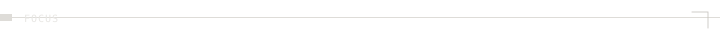

  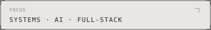
  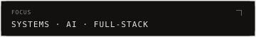

I build production-ready full-stack and AI systems, with a focus on scalable architecture, clean engineering, and shipping reliable software that solves real problems.

  
  

## Selected work

  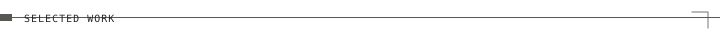
  

Confirmed public work only. Measured outcomes are not claimed without evidence.

### [DeepMed — AI Healthcare Platform](https://github.com/AliHassan-15/DEEPMED-Testing)

Structure patient intake before clinical consultation through a voice-first AI system that produces usable clinical context rather than free-form conversation alone.

Team of three. Technical Lead for overall technical direction, with ownership of system architecture, backend engineering, database design, API development, LLM workflow orchestration, AI integration, technical documentation, and the majority of testing and quality assurance.

Public evidence is the testing and QA companion repository: Jest unit tests, Stryker mutation testing, committed coverage and mutation HTML reports, and the FYP mutation-testing report under docs/. The main source repository remains private under university restrictions.

### [RouteWise ELD — Electronic Logging Device Platform](https://github.com/AliHassan-15/RouteWise-ELD)

Support U.S. trucking operational workflows with a full-stack ELD platform that models real driver and fleet processes rather than a thin CRUD shell.

Primary Full-Stack Developer — backend architecture, Django backend, database design, business logic, APIs, frontend, and frontend/backend integration.

Public source repository. Extended stack details beyond Django and the stated full-stack role remain Deferred under D-12 until Identity-grade confirmation.

### [Underwater Image Enhancement System — AI / Computer Vision · Full-Stack AI Application](https://github.com/AliHassan-15/Underwater-Image-Enhancement-System)

Restore underwater photographs through a custom model pipeline that continues through evaluation and a production-style web interface — not a notebook-only experiment.

Sole Developer — dataset preparation, model design, training, evaluation (PSNR/SSIM), Grad-CAM, FastAPI, React, and end-to-end deployment architecture.

Public repository includes AttentionResUNet training/evaluation notebooks, FastAPI inference server (`/api/enhance`), React frontend, and committed evaluation outputs under Code/Results.ipynb.

### [Codebase RAG — AI Developer Assistant](https://github.com/AliHassan-15/Codebase-RAG)

Answer natural-language questions over a codebase with responses grounded in retrieved source files rather than unconstrained generation.

Primary Developer — ingestion, embeddings, retrieval, context management, LLM integration, and end-to-end RAG architecture.

Public repository documents a RAG pipeline with Pinecone vector storage, OpenAI embeddings/LLMs, and Slack (/ai-coding-agent-help) as an interaction surface, alongside the Identity-confirmed stack.

### [Stellar Web Manager — AI Project Management Platform](https://github.com/AliHassan-15/Project-Management-System)

Support collaborative project management with AI assistance embedded in workflows — not as a detached chatbot surface.

Primary Developer — full-stack architecture, MERN stack, authentication and authorization, collaboration, analytics, AI assistant integration, APIs, and database architecture.

Public repository (Project-Management-System) with React client, Node/Express backend, and MongoDB models for users, projects, and tasks.

  
  

## Evidence

  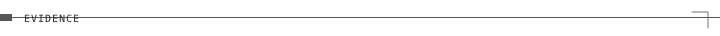
  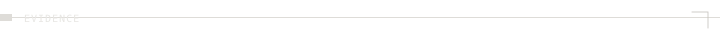

Public repositories used as proof channels:

| Project | Repository |
|---------|------------|
| DeepMed (testing / QA) | [AliHassan-15/DEEPMED-Testing](https://github.com/AliHassan-15/DEEPMED-Testing) |
| RouteWise ELD | [AliHassan-15/RouteWise-ELD](https://github.com/AliHassan-15/RouteWise-ELD) |
| Underwater Image Enhancement | [AliHassan-15/Underwater-Image-Enhancement-System](https://github.com/AliHassan-15/Underwater-Image-Enhancement-System) |
| Codebase RAG | [AliHassan-15/Codebase-RAG](https://github.com/AliHassan-15/Codebase-RAG) |
| Stellar Web Manager | [AliHassan-15/Project-Management-System](https://github.com/AliHassan-15/Project-Management-System) |
| RouteRefuel | [AliHassan-15/RouteRefuel](https://github.com/AliHassan-15/RouteRefuel) |
| GameStore | [AliHassan-15/GameStore-site](https://github.com/AliHassan-15/GameStore-site) |
| Brain Tumor Classification | [AliHassan-15/Brain-Tumor-Classification](https://github.com/AliHassan-15/Brain-Tumor-Classification) |
| Flashcards Generator | [AliHassan-15/Flashcards-generator](https://github.com/AliHassan-15/Flashcards-generator) |

  
  

## Engineering Companion

  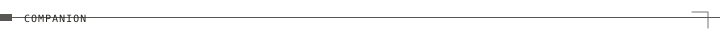
  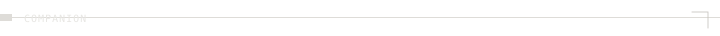

This README is the lobby.

The Companion is the engineering environment — Atlas, Journey, Architecture, Demonstrations, Evidence, and Case Studies as one continuous product.

  
  

**[Open Engineering Companion](https://alihassan-15.github.io/AliHassan-15)**

Local shell: [`companion/`](./companion)

  
  

## Contact

  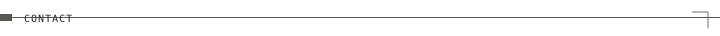
  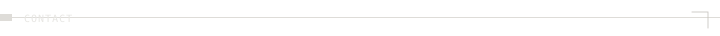

  
  

[GitHub](https://github.com/AliHassan-15) · [Companion](https://alihassan-15.github.io/AliHassan-15)

  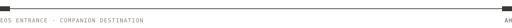
  

  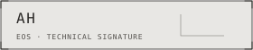
  

